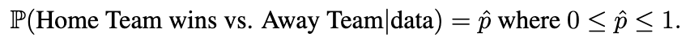
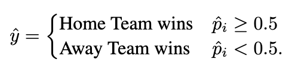
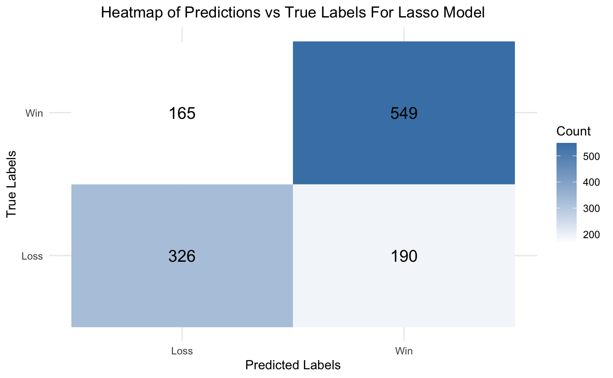
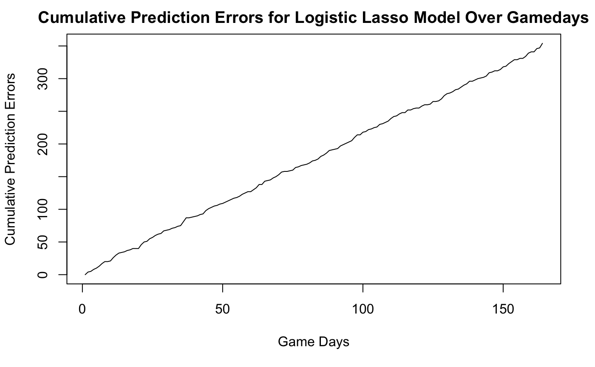
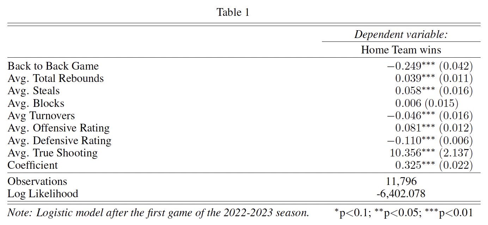
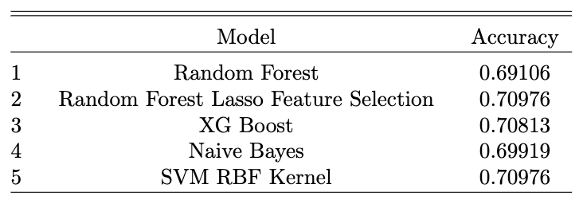

# NBA_Predict

This project was done in collaboration with Jeffrey Kuo, jrkuo2015 [at] berkeley [dot] edu, for Stat 230A under Professor Sam Pimentel.

To view detailed derivation of methods, please read [Method_Details.pdf](https://github.com/Ttantivi/NBA_Predict/blob/main/Method_Details.pdf)

## Introduction

This repository houses the predictive models we've created for predicting win/loss outcomes of NBA regular season games. The current focus is on the latest 2022-2023 season, where we employ historical team performance data, home field advantage and additional factors to inform our predictions.

Instructions: 
* Run [NBA_data_preprocessig.Rmd](https://github.com/Ttantivi/NBA_Predict/blob/main/NBA_data_preprocessing.Rmd) to create design matrix csv
* Models are contained in [NBA_Predict_Models.rmd](https://github.com/Ttantivi/NBA_Predict/blob/main/NBA_Predict_Models.Rmd)

## Motivation

With an emphasis on interpretability over complexity, we chose to utilize linear models as our primary tool for this task, starting with data from the 2012 season onward. The implications of such analysis are far reaching for NBA teams. The insights can affect decisions related to player acquisition and coaching strategies, potentially altering a team's revenues by hundreds of millions of dollars each year.

## Data

The data employed in this project is sourced from the nbastatR package. This comprehensive package includes data for every NBA game played in a particular season, covering various facets such as player performance (e.g., total points, minutes played) and home field advantage, among other factors. For this specific analysis, we leveraged the past 10 seasons of data, with the 2022 season alone contributing 26039 rows of observations.

To calculate the probability, we utilize data from the 2012 season up to the prediction day. For instance, when predicting the winners of teams playing on 12/12/2022, the training data includes all games from 2012 to 12/11/2022. Our covariates are constructed as the home team's average stats over their last 10 games minus the away team's average stats over their last 10 games. The following stats are used: 
* total rebounds
* totalsteals
* total blocks
* total turnovers
* offensive rating
* defensive rating
* true shooting
* win rate. 

To account for the pace of the game, all stats except true shooting and win rate are adjusted on a per 100 possessions basis. All the data wrangling was done within [NBA_data_preprocessing.Rmd](https://github.com/Ttantivi/NBA_Predict/blob/main/NBA_data_preprocessing.Rmd).

## Modeling
Our aim is to predict the outcome of a game using a binary function and understand the underlying factors contributing to the predicted probability.

### Probability Estimation

We seek to estimate the probability using the equation:

The predicted outcome of the game is determined by a binary function:

To gain an understanding of the data required for prediction, let's consider the scenario of predicting the winner between the Home Team and the Away Team. Our goal is to evaluate the relative strength of the Home Team compared to the Away Team. A higher quality measure for the Home Team, relative to the Away Team, corresponds to a greater value of the predicted probability, denoted as ˆp. To achieve this, we create a design matrix, where each row represents the arithmetic difference between the Home Team's performance and the Away Team's performance as the independent variable. The dependent variable is the win/loss outcome of the game. Each column in the design matrix represents a different quality measure for evaluation.

### Dual-Model Approach

Initially, our objective was to develop a single model that excelled in both prediction accuracy and inferential capability. However, we encountered a trade-off between these objectives during our research. We discovered that a model with excellent prediction accuracy suffered from multi-collinearity among variables, resulting in a significant impairment of its inferential abilities. Therefore, we implemented a dual-model approach:

1. Logistic Regression with LASSO Penalty: Emphasizes prediction accuracy.
2. Regular Logistic Regression: Focuses on extracting meaningful insights.

This approach enables us to achieve our objectives using separate, specialized models.

### Back-to-Back Games

We include a covariate to indicate the relative difference between each team in terms of whether the current game is a back-to-back (consecutive game). The covariate takes the following values:
- 1: Current game is a back-to-back for the home team only.
- 0: Current game is a back-to-back for both teams or for neither team.
- -1: Current game is a back-to-back for the away team only.

Please note that this is a simplified overview, and further information can be found in the accompanying documentation.

## Results
* Prediction-focused model: A logistic model with a LASSO penalty, optimized for prediction accuracy (achieved 71.22% accuracy).
* Precision: 0.7428
* Recall: 0.7689

* Inference-focused model: A standard logistic regression model, tailored to offer valuable insights (achieved 68.94% accuracy).

These results can be achieved by running the code in [NBA_Predict_Models.Rmd](https://github.com/Ttantivi/NBA_Predict/blob/main/NBA_Predict_Models.Rmd), after getting the design matrix from [NBA_data_preprocessing.Rmd](https://github.com/Ttantivi/NBA_Predict/blob/main/NBA_data_preprocessing.Rmd).

## How Do These Results Compare to More Complicated Machine Learning Methods?
The results below tell us that the Logistic Regression model with the LASSO penalty actually performed better than the more complex models. Furthermore, there is only a 2 percentage point difference between these more complex models and the inferential model.

Run [NBA_Predict_Other_Models.Rmd](https://github.com/Ttantivi/NBA_Predict/blob/main/NBA_Predict_Other_Models.Rmd) to get these results.
